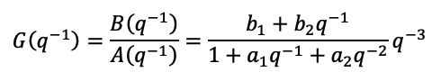

# ml-sys-id
MATLAB functions to identify linear models from time series data.

Note that most of these capabilities are included in the MATLAB system identification module (e.g. using the [`idpoly`](https://www.mathworks.com/help/ident/ref/idpoly.html) function)

However, I developed these as part of a control engineering graduate course and provide them for educational purposes and perhaps for simple use cases where you may want to implement them from scratch.

## Contents

Functions for system identification
- [disp_ols_dims_arx.m](disp_ols_dims_arx.m) - display the structure of an ordinary least squares (OLS) problem
- [idrar1.m](idrar1.m) - online estimatation of the parameters of a dynamic AR model
- [idar1.m](idar1.m) - estimate the parameters of a dynamic AR model from time series data
- [idarmax.m](idarmax.m) - estimate the parameters of a dynamic ARMAX model from time series data
- [idarx1.m](idarx1.m) - estimate the parameters of a dynamic ARX model from time series data
- [idarxct1.m](idarxct1.m) - estimate the parameters of a dynamic ARX model using constrained ordinary least squares
- [solve_ols.m](solve_ols.m) - general equation to solve OLS problem
- [solve_ols_properties.m](solve_ols_properties.m) - solve OLS problem and also returns sum of the squared residuals, white noise variance and covariance matrix.

Functions to run identification data generation experiments
- [gen_seqs_rbs.m](gen_seqs_rbs.m) - produces a random binary sequence of steps (steps at regular intervals)
- [gen_seqs_ros.m](gen_seqs_ros.m) - produces a randomly-occurring binary sequence of steps
- [idinput_from_seq.m](idinput_from_seq.m) - generate an excitation signal from a given step sequence 


## Example 1 - Identification of an ARX model

Suppose you have a time series of input and output measurements, u(k) and y(k), from an auto-regressive process. In this example the data is stored in the file `TP04_Q3.mat` in the 'data' folder:

```MATLAB
>> load('data/TP04_Q3.mat')
>> size(u), size(y)

ans =

    75     1


ans =

    75     1

>> [u(1:8,:) y(1:8,:)]

ans =

         0   -0.3269
         0   -0.8636
         0   -1.3269
         0   -1.4369
         0   -0.9990
    1.0000   -0.0325
    1.0000    0.8435
    1.0000    0.4339

```

And, suppose you know that the structure of the model is the following ARX model:



Then, you can estimate the model parameters, p = [a1; a2; b1; b2], as follows:

```MATLAB
>> na = 2; nb = 2; nk = 3;
>> p = idarx1([na nb nk],u,y)

p =

   -1.7866
    0.8102
   -0.3843
    0.4074

```

## Example 2 - Identification of an ARX model with constraints

Suppose, in the example above we are also able to determine that the static gain of the real system is -1.7.

This means that:

B(1) / A(1) = b1 + b2 / (1 + a1 + a2) = -1.7

or

1.7 a1 + 1.7 a2 + b1 + b2 = −1.7

We can impose this constraint using the two vectors F and G which represent the coefficients of the left and right-hand side of the equation:

F p = G

In this case, you can estimate the model parameters, p = [a1; a2; b1; b2], using the function [idarxct1](idarxct1.m) as follows:

```MATLAB
>> na = 2; nb = 2; nk = 3;
>> F = [1.7 1.7 1 1];
>> G = -1.7;
>> p = idarxct1([na nb nk],u,y,F,G)

p =

   -1.7888
    0.8088
   -0.3864
    0.3524

```

